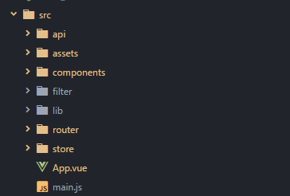
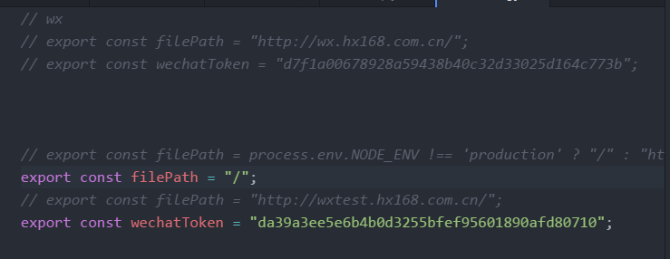
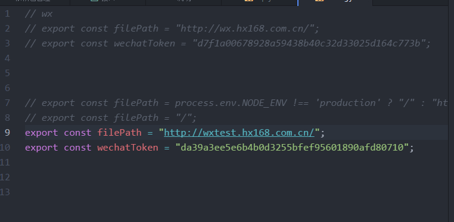
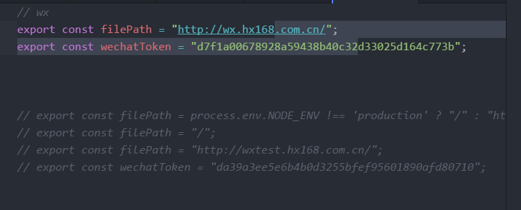

## 项目拷贝
1. 拷贝项目
2. 执行`npm install`安装依赖包

## 文件结构说明

1. `component` 组件文件夹
2. `store` 数据结构文件夹
3. `api` 环境配置文件夹

## 开发环境

1. 本地开发环境(`**/src/api/config.js`)
2. 运行`npm run dev`
> 

## 测试环境
1. 运行 `npm run build`
2. 上传打包文件
> 

## 生成环境

1. 运行 `npm run build`
2. 上传打包文件
> 
